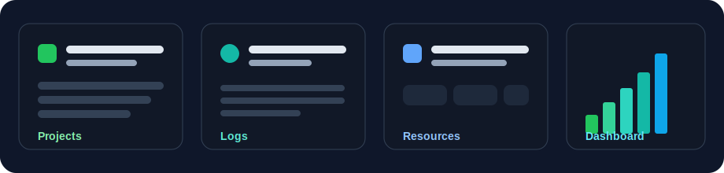

<div align="center">
  
  <h1>DevLog</h1>
  <p><strong>Track your projects, capture progress, and keep your dev resources organized.</strong></p>
</div>

<p align="center">
  
</p>

---

## What is this?

**DevLog** is a full-stack Next.js app built for developers who want a focused place to manage ongoing work.

It combines:
- **Project tracking** (status and descriptions)
- **Development logs** (what you built and learned)
- **Resource bookmarking** (useful links by project)
- **Dashboard insights** (activity + totals)

Whether you're building solo projects, client work, or learning in public, DevLog helps keep everything documented in one place.

## Tech Stack

- **Framework:** Next.js 16 (App Router) + React 19
- **Language:** TypeScript
- **Database:** SQLite + Prisma + better-sqlite3 adapter
- **Styling/UI:** Tailwind CSS + reusable UI components

## Clone and Run Locally

### 1) Clone the repository

```bash
git clone <your-repo-url>
cd DevLog
```

### 2) Install dependencies

```bash
npm install
```

### 3) Generate Prisma client

```bash
npx prisma generate
```

### 4) Run database migrations (if needed)

```bash
npx prisma migrate dev
```

### 5) Start the development server

```bash
npm run dev
```

Open [http://localhost:3000](http://localhost:3000) in your browser.

## Available Scripts

```bash
npm run dev    # Start development server
npm run build  # Build for production
npm run start  # Start production server
npm run lint   # Run ESLint
```

## Database Notes

- Prisma uses **SQLite** in this project.
- Local DB URL is configured as `file:./dev.db`.
- Prisma schema is located at `prisma/schema.prisma`.

## Project Structure (High-level)

- `app/` — routes, pages, and API endpoints
- `components/` — layout + reusable UI components
- `lib/` — shared helpers and Prisma client setup
- `prisma/` — schema and migrations
- `public/` — static assets (including README visuals)

## Contributing

1. Fork the repo.
2. Create a feature branch.
3. Commit your changes.
4. Open a pull request.

---

Made for developers who like shipping _and_ documenting.